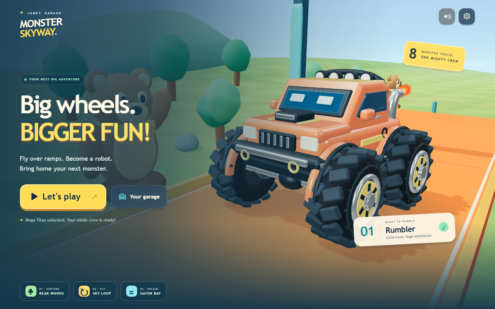
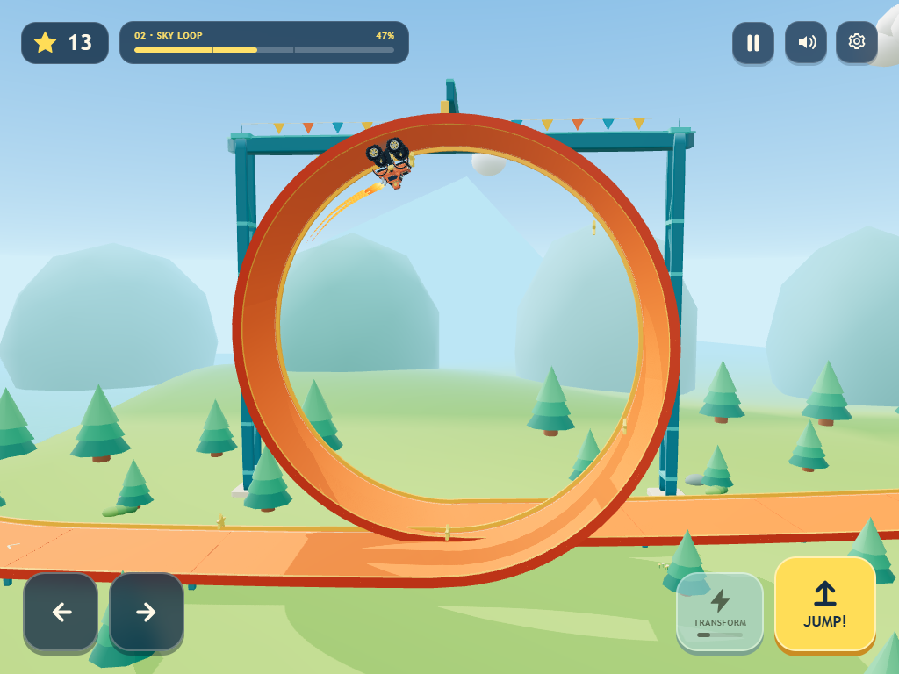

# Monster Skyway

**[Play Monster Skyway](https://yanivalfasykeelusa.github.io/james-monster-skyway/)** on an iPad, phone, or computer. Open the link in your browser; no game account or download is required.

A cheerful 3D monster truck game for little drivers. Race along a bright toy track, soar over ramps, ride a guided loop, transform into a robot guardian, and grow a garage of increasingly enormous trucks.

This project began with a three-year-old's love of monster trucks, orange stunt tracks, angular silver vehicles, and transforming robots. It explores what a family can create with AI as a development collaborator. The vehicles, characters, sounds, and scenery are original creations.



## Play

On iPad, open the game in Safari. Landscape gives the track more room, and portrait works too. To keep a shortcut beside James's other games, use Safari's Share menu, More if shown, then **Add to Home Screen** and **Add**. See [Apple's instructions](https://support.apple.com/guide/ipad/bookmark-a-website-ipadc602b75b/ipados).

Choose **Play** to start a short race. The truck accelerates automatically, ramps launch automatically, and the loop guides the truck through safely. A driver can enjoy and complete a race without steering or pressing jump.

- **Touch:** use the large on-screen controls to jump, steer, or transform when energy is ready.
- **Keyboard:** use the arrow keys to steer, Space to jump, T to transform, and P or Escape to pause. Menus also support Tab and Enter.
- **Transformation:** energy charges as you drive. Use the transformation control when charged; automatic activation helps little drivers enjoy the spectacle too.
- **Pause and sound:** use the visible controls to pause or mute. Sound starts after a user interaction and remains optional.

Every completed race awards stars. There are no lost lives or progress penalties. Unlocks and preferences save in this browser when local storage is available; if storage is blocked, the game keeps working with progress for the current session.

| Truck | Stars to unlock | Personality |
| --- | ---: | --- |
| Rumbler | 0 | A little orange truck with big ambitions |
| Bear Crusher | 12 | Purple paint and enormous paws of tires |
| Night Stomper | 24 | Dark bodywork and bright neon green |
| Gator Claw | 32 | A bold green ramp-loving monster |
| Chrome Guardian | 60 | Angular silver with a teal glow |
| Mega Titan | 100 | The biggest wheels in the sky |

These are original models inspired by broad toy and vehicle interests. The game does not include licensed vehicle replicas or branded characters.

## Run locally

Install Node.js 22.12 or newer (Node 24 recommended), then run:

```sh
npm ci
npm run dev
```

Open the local address printed by the development server. For an iPad on the same Wi-Fi network, run `npm run dev -- --host 0.0.0.0` and open the printed network address on the iPad. The computer's firewall must permit that local connection.

```sh
npm test
npm run build
```

The production build is written to `dist/`. Serve that directory with a static web server. Relative asset paths allow it to live under a repository subpath.

On Windows, double-click `Play.cmd` after building. It starts a small local server in the background and opens the game. On any supported Node.js platform, `npm run play` serves the built game at `http://127.0.0.1:4174`. To serve that build on your own Wi-Fi network instead, run `npm run play -- --lan` and use the computer's local network address.

For the browser regression suite, install a Chromium browser for Playwright once, then run:

```sh
npx playwright install chromium
npm run test:browser
```

The suite includes a complete real-time race, so allow about two minutes. `PLAYWRIGHT_CHROME_PATH` can point to an existing Chrome executable instead of downloading Chromium.

Set `PLAYWRIGHT_BASE_URL` to a deployed site's full URL (including its trailing slash) to run the same regression suite against that deployment. Without it, the test runner starts a local development server.

## Browser and audio requirements

The game needs a browser and device with WebGL 2 enabled. Rendering uses bundled code and procedural 3D models. Music-like effects and the quiet engine are synthesized with the Web Audio API; the game remains playable when audio is unavailable.

The running game does not fetch third-party assets, call external services, or require an account. Loading the site downloads its own application files from the host. Installing development dependencies requires an internet connection. There is no offline service worker in this release.

## Validation

The automated suite checks progression, save recovery, unattended completion, jumps, guided loops, transformations, pause behavior, and repeated finish updates. Run `npm test` to see the current results.

Chrome browser checks have exercised a complete race with emulated touch input, every ramp, the loop, automatic transformation, rewards, an earned truck selection, saved-progress reload, and replay with no browser errors. Desktop, phone, and iPad-sized layouts have been visually inspected. Real iPad/Safari performance and a child playtest remain pending. See [validation notes](docs/VALIDATION.md).

## Publish with GitHub Pages

The included workflow runs only when started manually with **Run workflow**. After choosing a repository, enable GitHub Pages with **GitHub Actions** as its source, then run **Deploy Monster Skyway** from the Actions tab. It installs dependencies, runs tests, builds the game, and publishes the `dist/` artifact to Pages.

The project is published from [yanivalfasykeelusa/james-monster-skyway](https://github.com/yanivalfasykeelusa/james-monster-skyway), with the playable site at [Monster Skyway](https://yanivalfasykeelusa.github.io/james-monster-skyway/). Its Pages source is GitHub Actions. Source changes remain separate from the live site until the deployment workflow is run.

## Next adventures

See [the roadmap](docs/ROADMAP.md) for polish, device testing, an eventual free-driving playground, and a separate construction vehicle adventure.



Read the [design notes](docs/DESIGN.md) and [asset credits](docs/ASSETS.md) for the decisions behind the game.

## License

[MIT](LICENSE). Contributions should use original or appropriately licensed material.
