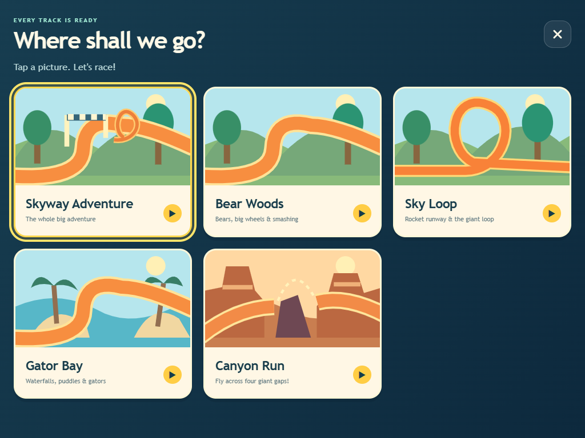
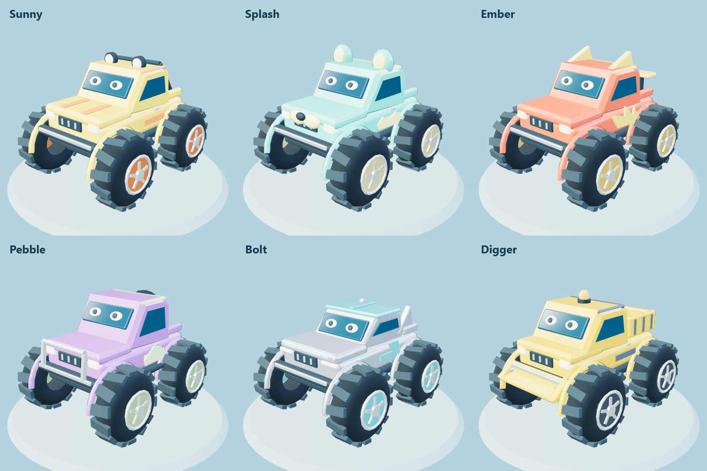
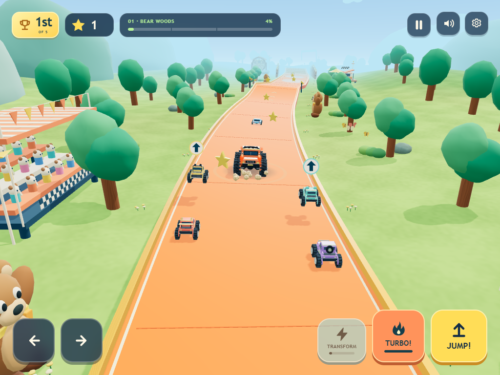
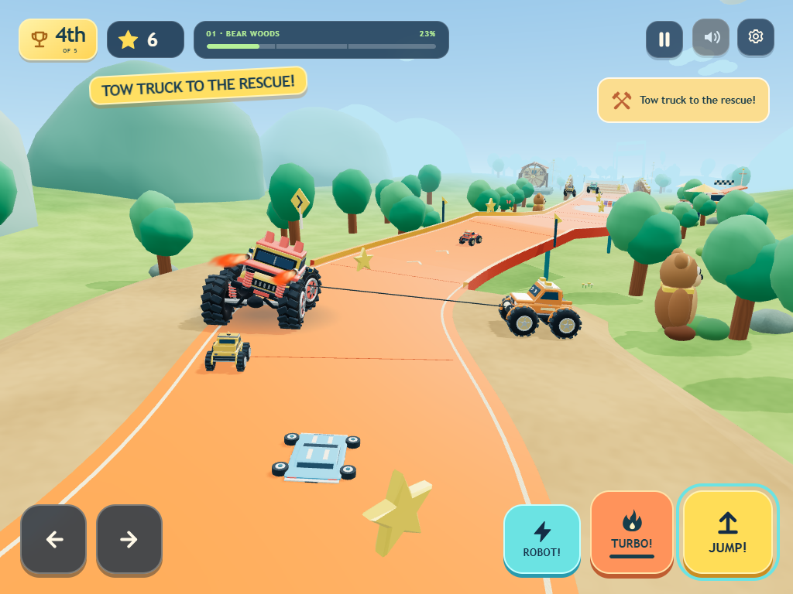
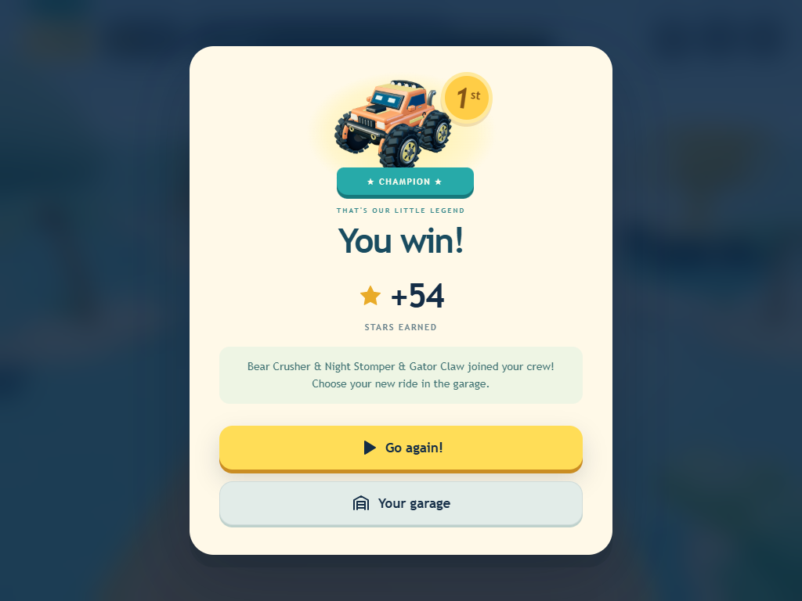
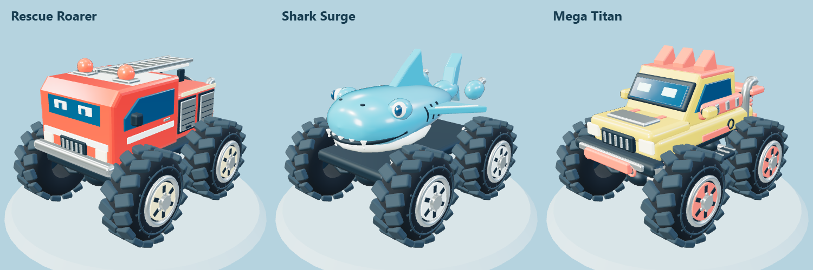
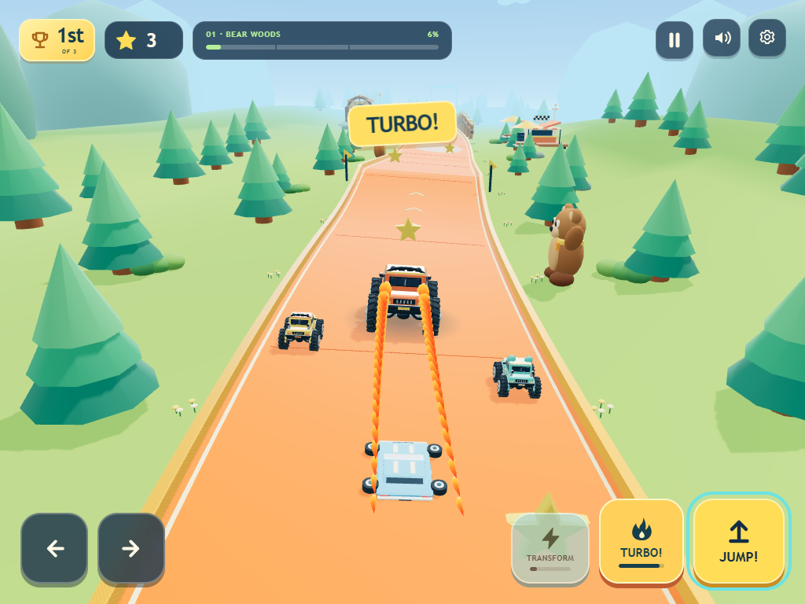
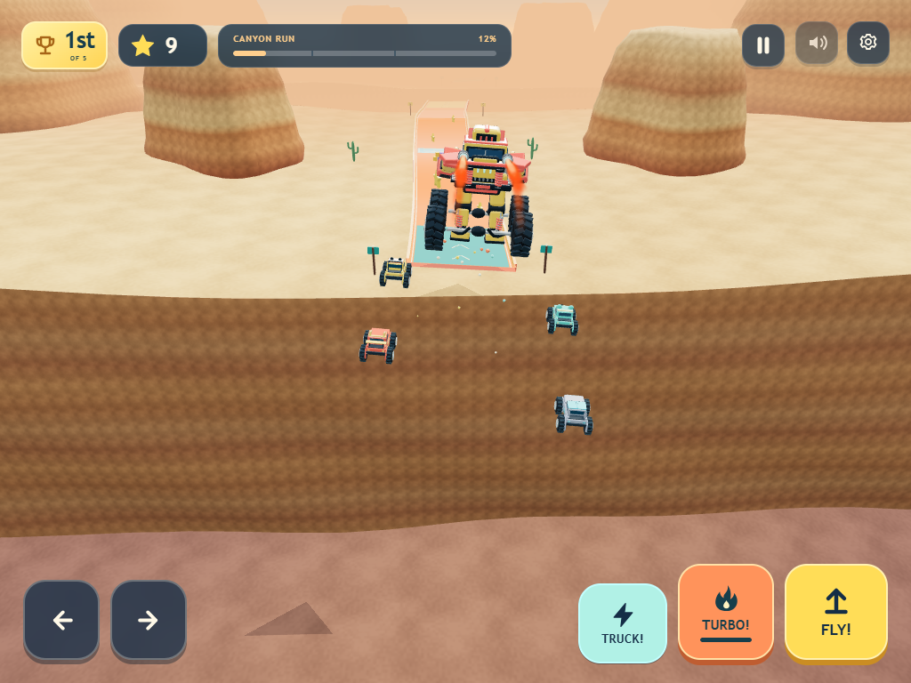
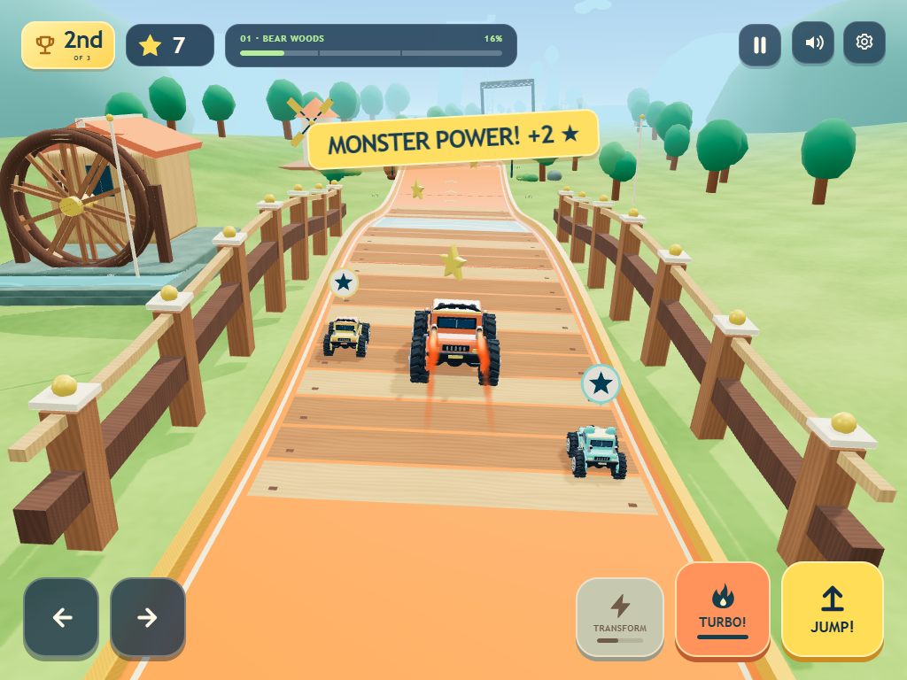
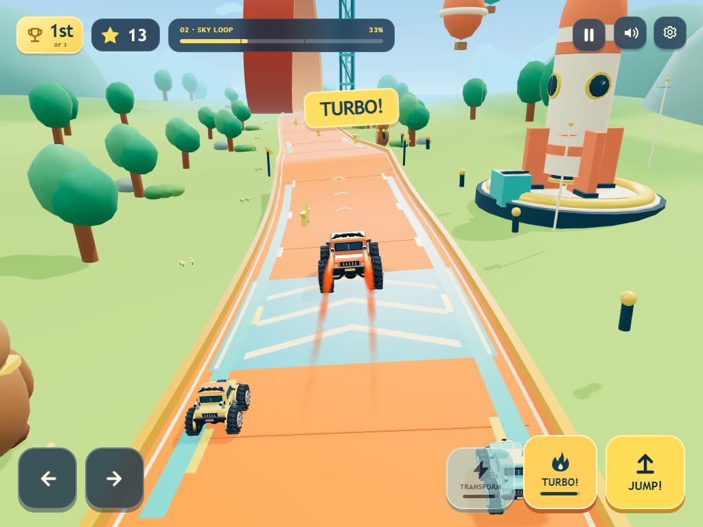

# Monster Skyway

**[Play Monster Skyway](https://yanivalfasykeelusa.github.io/james-monster-skyway/)** on an iPad, phone, or computer. Open the link in your browser; no game account or download is required.

A cheerful 3D monster truck game for little drivers. Choose a gentle Cruise or compete against four real rivals. Squash toy cars, fire up the turbo, become a flying robot, leap across canyons, steer through sweeping bends, and grow a garage of increasingly enormous wheels.

Rounded bodywork, sculpted tires, visible suspension, reflective paint and glass, warm sunlight and shadows give the trucks their toy-box feel. The raised orange track visits rounded woodland canopies, the Sky Loop festival, and Gator Bay, with cheering stands, playful landmarks, muddy splashes, and a gentle shower along the way.


## Meet James

Monster Skyway grew out of a simple wish: spend more time together. James's parent works in AI operations, and they began using AI to create projects together. At two and a half, James was already creating complete games with his parent's help and AI.

James is now three. He loves monster trucks, enormous tires, flames, transforming robots, sharks, and fire trucks. His dream is to become a monster truck driver when he grows up, something he's already shared at school. As one of Monster Skyway's creators, he shapes the game through his ideas and playtesting: more things to crush, canyons to jump, and a tow truck to bring a driver back onto the track. His parent guides development, and AI helps turn their ideas into code, artwork, and tests.

For this family, AI has expanded what they can create and given them another way to spend time together. We are sharing the game to show those possibilities and invite other families to play, suggest their own adventures, and help make it better. The hope is that projects like this help more people create things they care about and bring them closer together. The vehicles, characters, sounds, and scenery are original creations.

**[Read our story](https://yanivalfasykeelusa.github.io/james-monster-skyway/about.html)** · **[Help improve the game](CONTRIBUTING.md)**

## Play

On iPad, open the game in Safari. Landscape gives the track more room, and portrait works too. To keep a shortcut beside James's other games, use Safari's Share menu, More if shown, then **Add to Home Screen** and **Add**. See [Apple's instructions](https://support.apple.com/guide/ipad/bookmark-a-website-ipadc602b75b/ipados).

Choose **Let's play** for the saved track, or **Choose a racetrack** for five picture cards: the complete Skyway Adventure, Bear Woods, Sky Loop, Gator Bay, and Canyon Run. Every track is available immediately. The shorter races have their own starting lines and finishes. The truck drives automatically; ramps, the loop and canyon crossings guide the truck through safely. Cruise remains the default for new and existing saves and can be completed without pressing any driving controls. Choose **Rival Race** beside Play for an actual contest: steer through bends, find a passing lane, and time your turbo. Rivals can win. Grown-up settings offer Learning, Racing, and Fast opponents; earning stars never silently changes that choice.



Sunny and Splash bring two guests to each race: Ember, Pebble, Bolt or Digger. Each friend has a distinct little truck and favorite activity. They greet you with a smile, copy safe jumps after you, and cheer when you crush a car or use turbo. Sunny likes a playful race and can briefly pull ahead; Splash enjoys the puddles. Little pictures above their trucks show what they are doing, with at most two reactions showing together. The guests, reaction timing and butterflies' colors change between completed races, while the familiar route stays easy to follow.

| Friend | Favorite thing | Recognizable detail |
| --- | --- | --- |
| Sunny | A friendly race | Yellow pickup and roof lights |
| Splash | Puddles | Aqua truck with rounded roof bubbles |
| Ember | Jumping together | Red paint, flame panels and a little wing |
| Pebble | Crushing toy cars | Purple crawler with a rear spare wheel |
| Bolt | Turbo | Silver body and electric-blue accents |
| Digger | Building and big wheels | Yellow dump bed and a roof beacon |





Crushing a toy car gives you a little speed burst; turbo helps you pull ahead even faster. In Rival Race, each competitor has a fixed personal pace and timed boosts. Ember and Bolt sometimes guard a lane briefly; the others look for a clear pass. Opponents follow actual track positions and crossing times, with space around the trucks. There are no last-second teleports or guaranteed player wins.

**Off-road rescue:** marked dirt shoulders have openings in the rails. In Rival Race, steering too far onto a shoulder calls an orange tow truck, which winches you back while the others keep racing. The recovery pauses with the game. Loops, canyon flights, bridges and finish areas keep their guidance.



**Trophy time:** the actual winner takes the podium, whether it is you or a rival. The winner hops onto the other four toy trucks, squashes them gently, and everyone springs back intact. Tap **Victory stomp!** to replay the celebration or choose another race at any time. The animation never awards stars again. Every finisher still earns the normal completion reward.

**Closer view:** the chase camera brings tire, bodywork and suspension detail nearer. It gives flying robots and towing more room and pulls aside for the loop. Choose **Wide view** in Grown-up settings if that feels more comfortable.

- **Touch:** use the large on-screen controls to jump or fly, steer, fire the turbo, or become a robot. Steering and actions support separate fingers. Game surfaces suppress accidental pinch zoom, double-tap zoom and text selection; the garage and track picker still scroll.
- **Keyboard:** use the arrow keys to steer, Space to jump, B or Shift for turbo, T to transform, and P or Escape to pause. Menus also support Tab and Enter.
- **Turbo:** start with a full charge. A tap gives a short flame-powered burst; charge refills as you drive. Colored boost strips also trigger turbo automatically.
- **Crushing:** drive over the small parked toy cars to flatten them, earn two stars, recharge turbo and get a short speed burst. Two gold stars rise from the flattened toy so the reward is easy to see. Crushing always helps and never brakes the truck. Jumping clears a car.
- **Robot and flight:** tap **ROBOT!** at any time for an armored robot with fists, boots, wings and jet exhaust. **FLY!** launches a guided flight with a safe landing. **TRUCK!** changes back, waiting for a safe landing during guided flight. Automatic temporary transformation remains for drivers who leave the button alone.
- **Smashing:** drive into toy crates, barrels and block stacks for three stars, turbo charge and a speed burst. The larger robot tires count too. Each object pays out once per race; a replay restores the toys.
- **Pause and sound:** use the visible controls to pause or mute. Sound starts after a user interaction and remains optional.

Every completed race awards stars. There are no lost lives or progress penalties. Unlocks and preferences save in this browser when local storage is available; if storage is blocked, the game keeps working with progress for the current session.

### Play with a controller

Pair a supported Bluetooth or USB controller with the device, open the game, then press and release a controller button. A **Controller ready** message confirms that the browser has exposed it. On iPad, follow [Apple's controller pairing instructions](https://support.apple.com/en-us/111099). Use the public HTTPS game link for controller play; a plain HTTP Wi-Fi preview may not expose the browser's Gamepad API.

| Action | Xbox-style | PlayStation-style |
| --- | --- | --- |
| Steer / choose a menu item | Left stick or D-pad | Left stick or D-pad |
| Jump / fly / select | A | Cross (✕) |
| Become robot / truck | X | Square (□) |
| Turbo / back in menus | B | Circle (○) |
| Turbo alternative | Right trigger | R2 |
| Pause / resume | Menu | Options |

Gold outlines show the selected menu item. Disconnecting during a race pauses it. Reconnecting or resuming while holding an action button requires releasing it and pressing again. Support uses the browser's standard controller mapping; unknown layouts keep touch and keyboard available. Simulated controller input is covered in Chrome and WebKit; the family's physical controller and iPad combination still needs a play check.

The lobby shows your selected truck in the live 3D world. Garage cards use portraits rendered from the same models you drive.



| Truck | Stars to unlock | Design |
| --- | ---: | --- |
| Rumbler | 0 | Orange rally pickup with roof lamps, roll cage, and hood scoop |
| Bear Crusher | 12 | Purple bear ears, a honey-colored muzzle, and paw-print doors |
| Night Stomper | 24 | Low dark cab, neon green flame motifs, and a rear wing |
| Gator Claw | 32 | Long green snout, raised scales, and a friendly tooth bumper |
| Rescue Roarer | 40 | Red fire-engine body, ladder, equipment lockers and a rear hose reel |
| Shark Surge | 48 | Rounded shark body, pale jaw, friendly teeth, fins and a tail |
| Chrome Guardian | 60 | Faceted silver armor, swept fins, and a turquoise shield |
| Mega Titan | 100 | Lifted armored cab, exposed rear coilovers, and the biggest tires |



These are original models inspired by broad toy and vehicle interests. The game does not include licensed vehicle replicas or branded characters.


## Around the skyway



Canyon Run adds layered sandstone cliffs, desert plants, colored launch pads and four real gaps in the orange track. Your truck and all four friends fly across automatically.



Bear Woods climbs a timber bridge beside a giant waterwheel. Rocket Runway adds a launch pad, a tall toy rocket, and a boost toward the next ramp. Gator Falls brings a broad waterfall, reeds, and a waterfront boardwalk to the rainy lagoon. Picnic stops, balloons, friendly bears and alligators, stands, and the finish trophy garden fill out the route.

Wood grain, mottled grass, worn stone and water highlights give those places more texture. Nearby tree crowns have smoother, softly uneven outlines, with rounded hills along the horizon. Low sandy banks have uneven waterlines, gently shaded slopes, and rooted palms and alligator feet. The waterwheel turns beside the bridge and the woodland windmill slowly rotates its sails. Small butterflies flutter beside the woods; cattails sway and gentle ripples move through the lagoon. Gentler motion keeps these extra details still.






Steering turns the front wheels and leans the body. Left and right follow the chase camera's view for both touch and keyboard controls. Landings compress the suspension and kick up a brief dust burst and ring; Mega Titan's exposed rear coils shorten with the body dip. The chase camera follows your truck through the bends, then pulls aside for an upright view of the loop. Its wider option shows more of the surrounding race.


Shallow mud patches send little flecks from the tires, and a short, gentle shower passes through Gator Bay. Mud and rain are visual effects: they never slow the truck, change steering, or make winning harder.

Twin exhausts have pale hot cores, flowing amber flames and a soft cooling trail through jumps and loops. Bigger trucks bring bigger flames; guardian mode and turbo turn them up further. **Gentler motion** reduces camera movement, removes the landing ring, moving flame trail, rain, and tire spray, and keeps two small, steady exhaust flames and the mud scenery. Crushed cars show their flattened state immediately with this setting.


## Suggest the next adventure

A parent can open **Grown-up settings → Share an idea** to describe a feature or problem. The form saves a local draft, then prepares a public GitHub issue for review. A GitHub sign-in is required to submit; opening the link does not send it. Please leave out private or identifying details. No account is needed to play.

Maintainers can run `npm run feedback:queue` to collect the open feedback. Suggestions are checked for suitability, duplicates, feasibility, compatibility and performance before implementation. See [the feedback review workflow](docs/FEEDBACK.md). The queue never executes issue text or automatically adds unreviewed features.

You do not need to write code to help: tell us what made your little driver smile, what was confusing, or which controls did not work on your device. Developers, artists, and testers can use the [contribution guide](CONTRIBUTING.md) to propose a focused improvement or send a pull request. The game is shared under the [MIT license](LICENSE).

## Run locally

Install Node.js 22.12 or newer (Node 24 recommended), then run:

```sh
npm ci
npm run dev
```

Open the local address printed by the development server. For an iPad on the same Wi-Fi network, run `npm run dev -- --host 0.0.0.0` and open the printed network address on the iPad. The computer's firewall must permit that local connection.

```sh
npm test
npm run build
```

The production build is written to `dist/`. Serve that directory with a static web server. Relative asset paths allow it to live under a repository subpath.

On Windows, double-click `Play.cmd` after building. It starts a small local server in the background and opens the game. On any supported Node.js platform, `npm run play` serves the built game at `http://127.0.0.1:4174`. To serve that build on your own Wi-Fi network instead, run `npm run play -- --lan` and use the computer's local network address.

For the browser regression suite, install a Chromium browser for Playwright once, then run:

```sh
npx playwright install chromium
npm run test:browser
```

The suite includes full races on all five tracks, so allow about six to eight minutes per browser. `PLAYWRIGHT_CHROME_PATH` can point to an existing Chrome executable instead of downloading Chromium.

To exercise Playwright's WebKit engine, install it once and select `PLAYWRIGHT_BROWSER=webkit`:

```sh
npx playwright install webkit
PLAYWRIGHT_BROWSER=webkit npm run test:browser
```

In PowerShell, set `$env:PLAYWRIGHT_BROWSER = 'webkit'` before `npm run test:browser`; remove it with `Remove-Item Env:PLAYWRIGHT_BROWSER` to return to Chromium. WebKit and emulated touch viewports provide browser-engine coverage; they do not reproduce a physical iPad's Safari, graphics hardware, or touch behavior.

Set `PLAYWRIGHT_BASE_URL` to a deployed site's full URL (including its trailing slash) to run the same regression suite against that deployment. Without it, the test runner starts a local development server.

See [asset generation](docs/ASSETS.md) to regenerate garage portraits after changing a truck model.

## Browser and audio requirements

The game needs a browser and device with WebGL 2 enabled. Rendering uses bundled code and procedural 3D models. Music-like effects and the quiet engine are synthesized with the Web Audio API; the game remains playable when audio is unavailable.

The running game does not fetch third-party assets, call external services, or require an account. Loading the site downloads its own application files from the host. Installing development dependencies requires an internet connection. There is no offline service worker in this release.

## Validation

The friends use small local decision systems with individual timers and preferences. They react to successful actions and obey the same safe passing rules every time. They do not use a network AI service. See the [growing crew design](docs/DESIGN-GROWING-CREW.md), [working landmarks](docs/DESIGN-WORKING-LANDMARKS.md), and [research into comparable games and engines](docs/RESEARCH-PLAYFUL-WORLD.md).

Run `npm test` for race rules, progression and save recovery, truck and effect lifecycles, friendly racer behavior, and world geometry. The browser suite also checks steering against the visible road and completes a full race.

See [the validation record](docs/VALIDATION.md) for recorded test results, screenshot inspection, and public deployment evidence. James's parent reports that he is delighted with the existing game and has observed unwanted zoom/selection on iPad. This update addresses those interactions. Physical iPad/Safari checks with the family's controller and observations of this update remain follow-up work.

## Publish with GitHub Pages

The included workflow runs only when started manually with **Run workflow**. After choosing a repository, enable GitHub Pages with **GitHub Actions** as its source, then run **Deploy Monster Skyway** from the Actions tab. It installs dependencies, runs tests, builds the game, and publishes the `dist/` artifact to Pages.

The project is published from [yanivalfasykeelusa/james-monster-skyway](https://github.com/yanivalfasykeelusa/james-monster-skyway), with the playable site at [Monster Skyway](https://yanivalfasykeelusa.github.io/james-monster-skyway/). Its Pages source is GitHub Actions. Source changes remain separate from the live site until the deployment workflow is run.

## Next adventures

See [the roadmap](docs/ROADMAP.md) for turbo racing, device testing, future play ideas, and a separate construction vehicle adventure.

Read the [design notes](docs/DESIGN.md), [smoother world brief](docs/DESIGN-SMOOTHER-WORLD.md), and [asset credits](docs/ASSETS.md) for the decisions behind the game.

## License

[MIT](LICENSE). Contributions should use original or appropriately licensed material.
