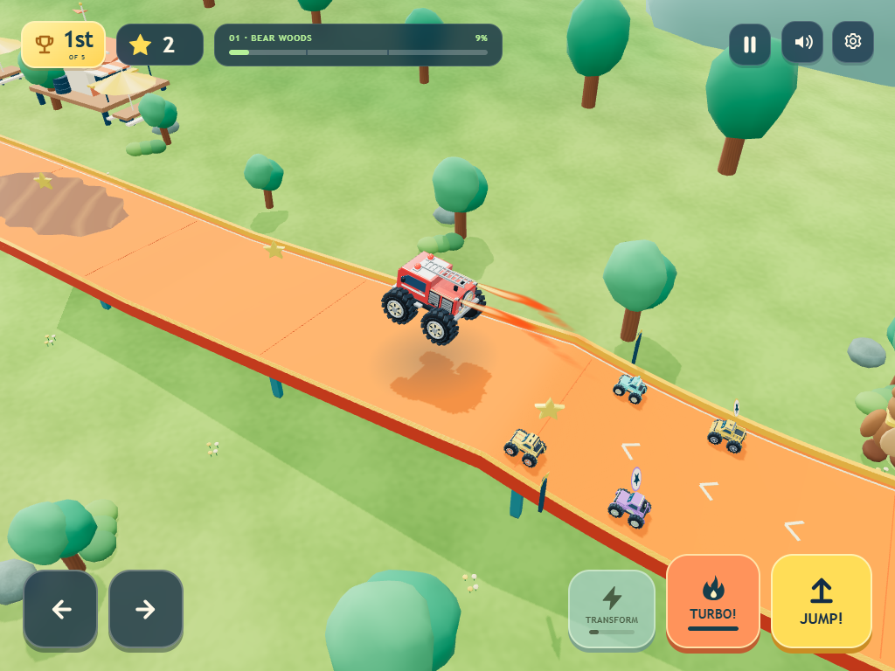
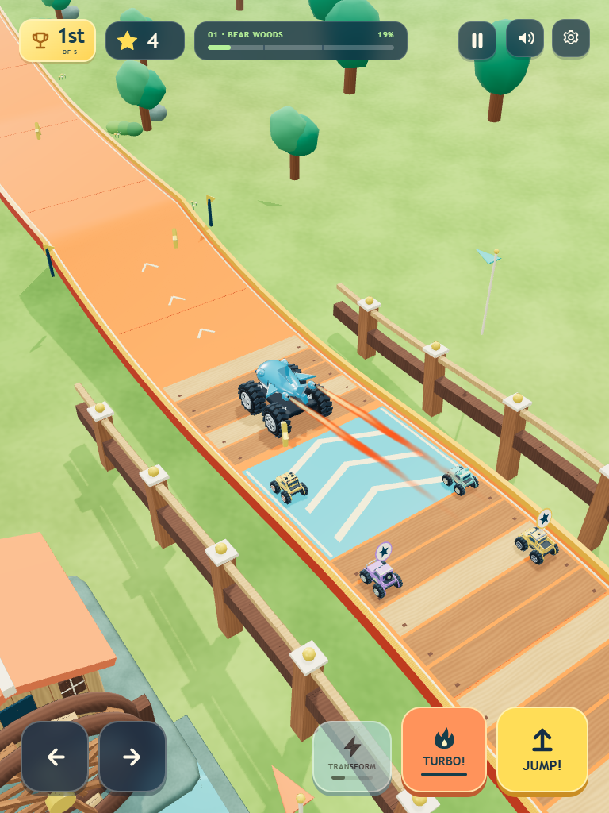

# iOS kids racing references

Checked September 11, 2026, approximately 16:00 EDT, using the US iPad App Store listings and their official screenshot assets. This is a visual and interaction reference study for Monster Skyway. Keep the current 3D game for this increment; evaluate a side-view alternative later with a small playable comparison.

## What the current chart establishes

Apple's accessible [US iPad Racing chart](https://apps.apple.com/us/ipad/charts/7013) showed a broad mix, including Race Master 3D, Mario Kart Tour, and Hill Climb Racing. None of the three references below appeared in its visible free top 25 at this check. That chart does not provide a ranking of suitable toddler games. These three were selected for relevance to the requested experience, not claimed chart positions. The term arcade here describes approachable racing; this research does not establish Apple Arcade subscription availability.

## Three useful references

Visual classifications below describe the inspected promotional screenshots. They are not claims about engines, asset formats, or implementation.

| Reference | Official age/ease information | Observed presentation and useful lesson |
| --- | --- | --- |
| **[Hot Wheels Unlimited — Budge Studios](https://apps.apple.com/us/app/hot-wheels-unlimited/id1523486249?platform=ipad)** | The listing describes finger steering/drifting, a boost button, stunt tracks, track construction, and challenges. Its metadata says 4+ and Made for Ages 6–8. It is free with in-app purchases/subscription offers. Category: Entertainment. | Perspective 3D chase racing, with a separate overhead track-building view. The player truck, bright road, loops, and giant animal landmarks read at different scales. The rear view clearly exposes tire tread and suspension. Useful reference for a solid toy-like 3D world, but its listed steering and construction demands are more involved than our guided driving. That comparison is our design assessment. |
| **[Monster Truck Games: for kids / Monster Truck Go — Yateland](https://apps.apple.com/us/app/monster-truck-games-for-kids/id1213648603?platform=ipad)** | Stable app ID 1213648603 resolves the changing store title. Description targets ages 2–6 and advertises one-touch driving, offline play, and no third-party ads. It is free with in-app purchases. Category: Education. | Side-on trucks travel across an easily read ground profile against layered illustrated backgrounds. Strong body motifs, capes, wings, bright wheels, and large impact shapes carry much of the visual interest. Terrain and vehicle shapes remain easy to separate. Useful reference for clear silhouettes and an uncomplicated route through scenery. |
| **[Monster Trucks Game for Kids 2 — Raz Games](https://apps.apple.com/us/app/monster-trucks-game-for-kids-2/id1112826306?platform=ipad)** | Description targets ages 2–8, says trucks do not flip, and says opponents slow down when ahead. Large horn/jump/music buttons, crushing and stars are described. Free with in-app purchases; advertising is disclosed. Category: Family. | Side-on racing with shaded, depth-styled trucks and scenery: a 2.5D-looking presentation, without establishing its rendering technology. Bodies sit high above the wheels on long, visible shocks and open chassis frames. Truck profiles, ramps, and crush targets are clear. The most relevant reference for making huge suspension feel like the vehicle's defining feature. |

The age statements are different fields, not interchangeable guarantees of usability: all three listings currently show a 4+ rating and Made for Ages 6–8 metadata, while Yateland and Raz describe younger intended players. Yateland's own [Monster Truck Go page](https://yateland.com/apps/monster-truck-go/) instead targets ages 2–5 and also emphasizes one-touch driving. That mismatch is why this study focuses on concrete controls and our actual toddler experience rather than turning a store label into an ease ranking.

## Screenshots inspected

Three official iPad screenshots per app were downloaded directly from the image URLs embedded in the current Apple listing HTML. They are promotional images, not hands-on recordings. The following are representative source assets:

- [Hot Wheels chase race](https://is1-ssl.mzstatic.com/image/thumb/PurpleSource211/v4/2b/d3/fc/2bd3fcd2-81dd-81b4-7b46-887205e8b426/HW_Screenshots_iPad-Launch.jpg/1286x964bb.webp) and [overhead track construction](https://is1-ssl.mzstatic.com/image/thumb/Purple221/v4/bc/54/6f/bc546fb2-043d-a3f1-af1d-ac78af3a1c77/d6e479b7-a827-43a0-a722-bde15f5301f6_HW_Screenshots_iPad_WW_3.jpg/1286x964bb.webp).
- [Yateland side-on descent and jumps](https://is1-ssl.mzstatic.com/image/thumb/PurpleSource221/v4/6a/a1/6b/6aa16bb7-b82b-0e14-105b-cb163e942b81/5.png/1286x964bb.webp) and [large truck impact](https://is1-ssl.mzstatic.com/image/thumb/PurpleSource211/v4/bb/be/bb/bbbebbca-258b-c2b5-3370-8a3c80206417/9.png/1286x964bb.webp).
- [Raz trucks, shocks, and crush target](https://is1-ssl.mzstatic.com/image/thumb/PurpleSource126/v4/6f/3d/9f/6f3d9f21-0f70-e7a9-6617-8a37cc0ff420/983146c3-91c6-46bd-b98d-58603b3adf74_1b.png/1286x964bb.webp) and [open chassis over ramps](https://is1-ssl.mzstatic.com/image/thumb/PurpleSource116/v4/64/c7/8b/64c78b57-69ac-3336-3c59-cabd12f5ae64/cb7f5aaf-26bd-4aa4-b05d-75bad1ebba8f_2b.png/1286x964bb.webp).

Scratch evidence is `.tmp/ios-appstore-image-manifest.json`, `.tmp/ios-{hot-wheels,yateland,raz}-ipad-{1,2,3}.webp`, the three saved listing HTML files, and `.tmp/ios-ipad-racing-chart.html`. These copies are reference evidence; they are not game assets.

## Apply to our truck forms now

The following are proposed original designs for the user's requested forms, rather than a claim that these exact trucks were present in the inspected screenshots.

| Truck | Shape that should communicate its identity | Detail that must survive the driving camera |
| --- | --- | --- |
| **Fire engine** | Tall, squared cab joined to a long service body; a real roof ladder silhouette, hose reel, and broad light bar. Use stepped compartments and rounded fenders to give the body mass. | From behind, the ladder rails, service-body width, and rear hose/compartment panel should identify it before its red paint does. Keep ladder ends blunt and inside the driving envelope. |
| **Shark** | A continuous curved shark body around the cockpit, broad snout, a pale lower jaw, one dorsal fin, paired side fins, and a recognizable tail. Shape the hood and rear body as the animal. | Dorsal fin and tail must remain visible from the chase view; side views should read the snout and jaw. Use a friendly eye and rounded fin tips. A fin attached to a generic pickup is insufficient. |
| **Huge-shock truck** | A compact upper body lifted above an exposed frame, oversized wheels, and four large suspension units with visible coil spacing. Preserve open space between body, frame, and wheels. | At rest, each visible shock must read as a spring and damper rather than a colored rod. On landing, the gap should visibly compress and recover, while wheels stay grounded. Avoid hiding all of the suspension behind the tires. |

Use the selection view to show each side/front profile, and make the rear design equally distinct for actual play. A useful acceptance check is recognizing all three as uncolored silhouettes at the real 1024 × 768 and 768 × 1024 driving/selection sizes, then checking the smaller 390-pixel viewport. Colors should reinforce a shape that already reads.

Retain guided forward movement, generous road clearance, clear crush rewards, and the existing pause/gentler-motion behavior. Add form and material quality before adding more buttons or additional decorative fragments. Verify ordinary and largest guardian sizes with the actual camera, including a landing and nearby buddies, so the suspension and identity remain visible without crowding the roadway.

## Our 2.5D camera study

The reference screenshots prompted a comparison using our actual fire engine, shark and Titan, with the same automatic driving, four friends and 3D world. Six camera arrangements were tested. A rear-oblique angle, closer to the rear in portrait, showed the strongest truck silhouettes while keeping the convoy and upcoming road visible. This experiment used the existing Three.js renderer.

These are study renders. The public game retains its current chase camera. Twenty-four matched HUD compositions show the three trucks at crush, jump, bridge and loop moments in both tablet orientations. The final fitted composition keeps the truck and friend bounds clear of the HUD in those samples. Six full-course runs cover 23,616 simulated frames and keep all actors and the sampled forward road inside the camera frame. This verifies framing in the experiment; it does not establish child comfort or physical-iPad performance.

The remaining issues are visible: the approach road can obscure the truck during the loop transition, gate posts can cover friends, and reaction pictograms still face the original camera. The landscape loop also makes the player smaller. A production version would need deliberate occlusion handling, active-camera billboards, consistent directional controls, explicit pause/reset behavior and reusable math buffers. It should first become a small playable comparison on the family's device. The study supports further camera work; it does not justify replacing the current renderer or publishing this camera as a finished mode.

Local reproduction and complete findings are retained in `.tmp/refined-camera-study-report.md`, with a private comparison gallery and two motion clips. The original captures above are included in the repository so the visual direction remains reviewable without those scratch artifacts.
