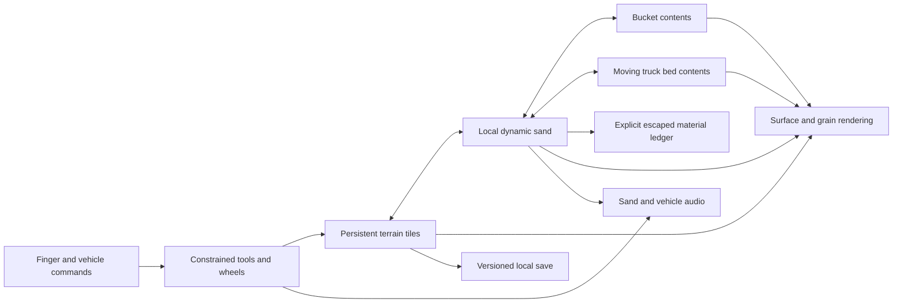

# James's Sand Yard — proposed game design

Date: 2026-09-22. Working title; James can name the game. Status: researched design ready for family review. No native game or iPad performance result exists yet.

## The experience

A large, believable construction sandbox for iPad. James can dig a trench, curl an excavator bucket through a pile, lift a heavy load, pour it into a dump truck, drive away, tip the bed, and reshape the new pile. A wrecking ball and a monster truck belong in phase 1. Later, a separate mode adds races and playful vehicle battles.

The reason to repeat an action should be the action itself: a clean scoop, the first trickle from a tilted bucket, sand sliding off a ridge, a soft tire rut, the sound of grains landing in a metal bed. Treat “addictive like real sand” as a design aspiration for intrinsically satisfying play. Success is James choosing to explore and repeat satisfying actions; sessions can end comfortably at any time.

## Decisions and assumptions

| Item | Current decision |
| --- | --- |
| Delivery | Native iPad app; GitHub stores source, plans, and eventually a website link to the app. |
| Engine | Trial Unity 6.3 LTS, URP, C#, Metal; commit only after an actual device benchmark. |
| Sand | Dry sand first. A cohesive kinetic-style material is a separately evaluated material, not a “stickiness” slider promised to work. |
| First experiment | A 4 m × 4 m tray, movable bucket, movable/tilting truck bed, finger tool, fixed camera, and measurement tools. |
| First large playground | Proposed 64 m × 64 m construction site with bounded active simulation; size is negotiable after device evidence. |
| Device | James's exact iPad and iPadOS version have been requested and remain unknown. No supported-device claim yet. |
| Build access | Windows workstation confirmed. A Mac/Xcode build and physical iPad test route still needs identifying. |
| Controls | Landscape first, finger input sufficient, no reading or multi-button coordination needed to begin. |
| Initial play | Offline, single player, immediate access to the sand and core vehicles. |
| GitHub | Existing `jamesgarage/jamesgarage.github.io` is confirmed by its local remote and a successful remote read. |
| Source location | Propose `games/sand-sandbox/` in that repository; isolate its build from Monster Skyway. A future extraction to its own repo can preserve history. |

The [engine research](ENGINE-RESEARCH.md) and [sand research](SAND-RESEARCH.md) distinguish verified capabilities from these engineering decisions. Unity is provisional; no source establishes that the complete vision already runs at our desired fidelity on an iPad.

## Phase 1 scope

1. **Sand play:** push, scoop, pour, smooth, build piles, dig channels, collapse slopes, and reset a local area. A hand tool allows sand play without driving.
2. **Excavator:** tracks, rotating upper body, articulated boom/stick/bucket, useful reach limits, visible bucket load, credible digging resistance, and spill from the lip.
3. **Dump truck:** drive, receive sand, carry it, raise the bed, open the tailgate, and unload. Load location and mass affect the vehicle.
4. **Wrecking ball:** a crane with a constrained pendulum and weighty impacts. Knock down reusable block structures and disturb the sand. Start with reusable rigid blocks; arbitrary building fracture is beyond this milestone.
5. **Monster truck:** accessible from phase 1; large tires compress and displace sand, form ruts, climb piles, land with suspension movement, and recover with one obvious action.
6. **Big sandbox:** room to move material between several play areas, persistent edits, camera framing for close inspection and free driving, local autosave, pause, reset with undo/recovery.

A wheel loader and bulldozer are expansion candidates once those five core interactions pass. Vehicle branding and art are original or licensed. Vehicle models require working pivots, bucket interiors, bed interiors, and underside silhouettes; appearance alone is insufficient for close sand play.

## Phase 2 scope

Add a distinct race/destruction choice after phase 1 works. Begin with offline AI opponents, generous checkpoint races, a contained vehicle arena, reversible damage, and quick recovery. Reuse the same sand, traction, load, and contact systems. Keep solo sand play available directly.

Online multiplayer, accounts, chat, a shared persistent world, and arbitrary real-time fracture are separate projects. They are not prerequisites for racing or fighting other construction vehicles.

## Touch and camera design

Use three clear contexts: **hand**, **operate**, and **drive**. A picture selects a vehicle/tool. In hand mode, one drag pushes/rakes sand; a large mode button changes to scoop or smooth. In operate mode, a large bucket handle follows a constrained target with motion smoothing; a large curl gesture/control tips it. Test direct dragging against assisted scoop-and-pour controls with James before locking the mapping. In drive mode, one broad steering/throttle control and one brake/reverse control are sufficient for the first test; assisted driving is an option.

An active drag owns its finger ID until release or cancellation. A second finger must not switch the active tool or accidentally take over the camera. Camera orbit/zoom begins only when no sand/vehicle drag is active; offer visible camera controls as an alternative. Releasing outside a control, interrupting the app, pausing, and resuming must stop the actuator safely.

Aim for 56–72 point action areas, with 44 points as the lower bound for frequent controls. Place the bucket target slightly above the finger and render a visible contact hint so the finger does not hide the result. These are proposed design dimensions; verify actual point sizing and safe areas on the device. Apple recommends large, reachable controls and direct interaction where appropriate. [Apple game controls](https://developer.apple.com/design/human-interface-guidelines/game-controls)

Keep the camera stable during precision pouring. Use an optional closer view, restrained camera shake, reduced motion, independent engine/sand sound levels, and a mute button. A finger should trigger a visible reaction immediately even while the physical tool follows at a credible speed. Input prediction may move a cursor; it must never transfer irreversible mass before confirmed input.

The glass cannot reproduce the physical texture of sand. Design the impression through low latency, visible resistance/release, coherent grain movement, weight, and synchronized sound. iPad built-in vibration is not a dependency. [Apple haptics](https://developer.apple.com/documentation/corehaptics/preparing-your-app-to-play-haptics)

## Material architecture

The first approach is a heightfield-based mass store for resting sand and a bounded particle region for sand that is moving or contacting a tool. Coarse physical particles can drive finer visible grains. Untouched terrain sleeps. A truck bed has a separate frame of reference; its contents are not glued to a world-space terrain tile. The research documents prior work supporting this architecture, not an off-the-shelf iPad implementation.

**Ownership invariant:** each unit of material belongs to exactly one terrain cell, active particle, bucket/bed resting store, or explicit escaped/removed store. A contained active particle is still counted only in the active store. Every conversion debits and credits atomically. Decorative grains and dust carry no gameplay mass. Compaction changes volume at the same mass.

**Conservation:** `initial + explicitly added = ground + active + resting bucket + resting bed + escaped/removed`. The reference accounting core uses integer grams to make transfers exact. The solver can aggregate physical mass differently internally, but its boundary conversion retains fractional residuals and reconciles to that ledger. A large initial pile must not hide repeated small losses; report error relative to transferred mass too.

**Excavation:** a swept bucket volume intersects the terrain over the full motion interval. Activate only removed material, impose bucket contact/friction and capacity, and couple resistance to the actuator or vehicle. A brush that removes terrain and increments a load counter is a useful early accounting test; it does not satisfy the final digging requirement.

**Transport:** resting bucket/bed contents follow their carrier. Changing carrier acceleration or tilt can activate material and cause sliding/overflow. Release velocity includes translation and angular motion, `v_release = v_carrier + omega × (releasePoint - carrierCenter) + relativeFlow`. Use bounded substeps for fast movement so grains do not tunnel through the bucket, bed, or ground.

**Terrain and tires:** surface edits update only affected visual tiles; vehicle support samples authoritative terrain heights/normals. Do not recook the entire world collider every frame. Tire rutting displaces material laterally, compaction preserves mass, and support/traction change with the rut. Track decals alone cannot meet the monster-truck requirement.

**Rendering:** layered sand shading, coherent granular flow, contact shadows, restrained dust and stable lighting should hold up in a close view. Avoid liquid-looking splashes, hovering grain clouds, sparkly visual noise, and generic liquid shaders presented as sand.

**Limits:** a single height surface cannot represent overhangs, tunnels, or detached cohesive sculptures. If moldable sand is prioritized, evaluate a small 3D cohesive tray with hold, knead, cut, and fracture tests. Do not expand the production map until the selected material behavior is demonstrated.

## Proposed performance and quality gates

These values are project acceptance targets, not achieved measurements. Revisit them with explicit recorded reasons once the minimum device is selected.

| Gate | Pass condition and evidence |
| --- | --- |
| Native build | Reproducible signed iPad build; exact editor, packages, Xcode, SDK, device, OS and commit recorded. |
| Sustained response | 20-minute run targeting 60 fps; P95 frame interval ≤20 ms and P99 ≤33.3 ms; no sustained thermal fall to 30 fps. Report per-minute data as well as aggregate. |
| Input | High-speed video where available: median touch-to-visible response ≤50 ms, P95 ≤80 ms. Internal input timestamps alone do not measure display latency. |
| Conservation | Accounting tests exact; physical 100-cycle scoop/dump test unexplained error <0.5% of moved mass and no systematic drift or duplication. |
| Containment | No visible leakage in slow carry tests; tilt/overflow changes flow naturally, including a moving bed. |
| Material | Stable resting piles; slope collapse, discharge and cut shape compared with the chosen real sand sample; record calibrated material parameters. |
| Headroom | Starting allocations: sand CPU ≤4 ms, combined CPU frame work ≤12 ms, GPU frame work ≤12 ms at the agreed render resolution. CPU/GPU overlap; do not add these as serial time. |
| Memory | First tray target peak resident memory <500 MiB; phase 1 provisional <1 GiB. Device memory pressure/jetsam logs decide whether these are safe. |
| Feel | Across three short voluntary sessions, James can perform three transfers with at most initial demonstration, explores a new action, and chooses an action to repeat for its feel. Observe frustration and accidental controls; do not infer satisfaction from duration alone. |

Sweep active particle caps of 1,024, 4,096 and 8,192 with the same camera and input replay; these are experimental levels, not promised production counts. Test shadows, decorative grains, and render resolution independently. If the budget is exceeded, reduce decorative work first. A stable 30 fps experiment can diagnose problems but is not a silent pass for the 60 fps tactile goal.

## Failure and recovery behavior

Pause stops sand, tools, vehicle motion, and timers together. Resume clears stale touch IDs and uses bounded timesteps. Save failures preserve the running session and the last good save. Save files have a schema version, bounded counts, material settings, world seed, terrain deltas, vehicles, and unique authoritative mass ownership. Write through a temporary file and replace after validation; retain one previous valid save.

Over-budget particle activation defers or coarsens material without deleting mass. Out-of-bounds sand goes to an explicit collector or escaped ledger. Physics instability freezes/recoveries the affected tool locally and records the state for debugging; it must not reset the entire sandbox without the player's choice. Reset is visibly separate from play controls and reversible within the current session.

## Development boundaries

The [first implementation plan](../../.references/plans/2026-09-22-james-sandbox-implementation.md) covers **P0A only: a deterministic accounting and terrain reference kernel with a repeatable transfer check**. It is deliberately small enough to implement and review independently, and can run on the confirmed Windows tools while native build access is arranged. It is not the native feel test and cannot pass that gate.

The [roadmap](ROADMAP.md) covers P0B native feasibility, the phase 1 game, and phase 2. Each downstream subsystem gets a detailed implementation plan after its prerequisite interface/benchmark is real. This avoids pretending an unmeasured research problem has already been solved in a giant fixed plan.

## Decisions needed for execution

- Exact iPad model/OS and Mac or other legitimate macOS build access.
- Dry loose sand first versus making cohesive sand the primary research target.
- Review of this proposed native Unity route and phase order.

No engine, asset package, membership, or cloud build purchase has been made. No app, TestFlight build, or website deployment has been performed.
